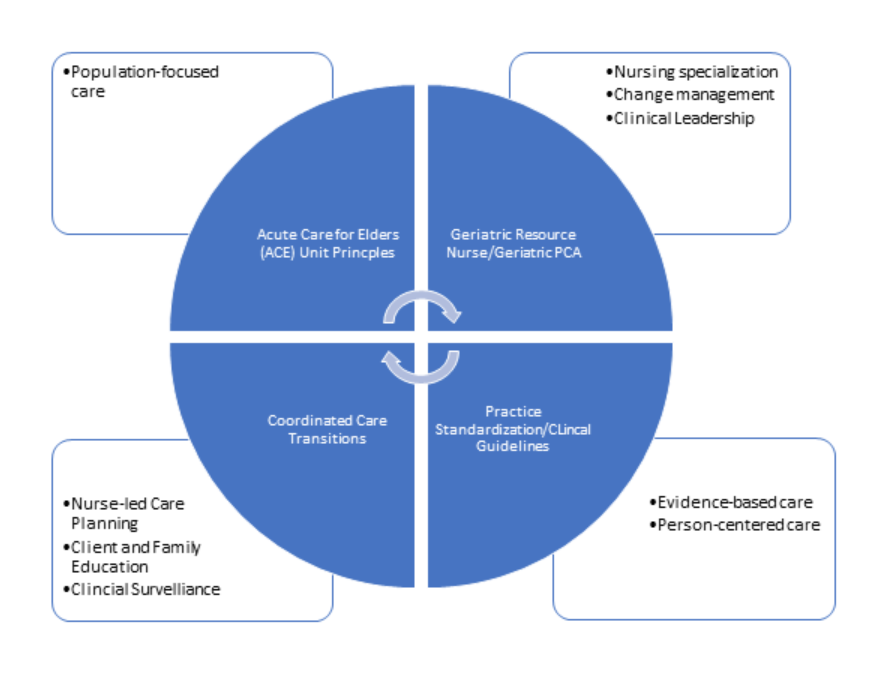
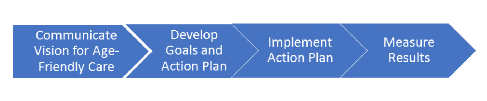

```{r setup, include=FALSE}
knitr::opts_chunk$set(echo = FALSE, message=FALSE, warning=FALSE, comment=NA, fig.width = 6, fig.asp = 0.618, out.width = "60%", fig.align = "center", fig.show='hold')
```

```{css margin_init, echo=FALSE}
    body .main-container {
      width: 80% !important;  
      margin-left: 10% !important;
      margin-right: 10% !important;
    }
    body {
      width: 80% !important;
      margin-left: 10% !important;
      margin-right: 10% !important;
    }
```

```{r item_graph_function}
# create graphing function
item.graph <- function(df, na.rm = TRUE, ...){
  
  # create list of counties in data to loop over 
  item_list <- unique(df$Item)
  
  # create for loop to produce ggplot2 graphs 
  for(i in seq_along(item_list))
    { 
    # create plot for each county in df 
    plot <- ggplot(subset(df, df$Item==item_list[i])) +
      facet_wrap(~Level, ncol = 2, strip.position = "bottom") +
      geom_bar(aes(x = factor(1), y = Percent, fill = Response, label = Percent), 
               position = "fill", stat = "identity", width = .6, color = "white") +
      coord_polar(theta = "y", 
                  start = -pi/2) +
      geom_text(aes(x = 0, y = 0, label = label, color = Response), size = 6.5) +
      # geom_text(aes(x = 0, y = 0, label = label_2), 
      #           size=5.5, 
      #           vjust = 1.5) +
      # geom_text(aes(x=0, y=0, label = Item),
      #          size=2.2,
      #          vjust = 5.5) +
      theme_void() +
      scale_fill_manual(values = cols) +
      scale_colour_manual(values = cols) +
      theme(strip.background = element_blank(),
            strip.text.x = element_text(face = "bold")
            ) +
      guides(colour=FALSE) +
      ggtitle(item_list[i])
  
  print(plot)
  }
}
```

```{r initialize}
hospital_names <- unique(giap$`Hospital.Name`)[!is.na(unique(giap$`Hospital.Name`))]
cohort_n <- nrow(giap)
hospital_n <- nrow(giap %>% filter(Hospital.Name==name))
id <- unique(giap$Hospital.ID[giap$Hospital.Name==name] %>% na.omit())

wrap_15 <- wrap_format(15)
wrap_20 <- wrap_format(20)
wrap_30 <- wrap_format(30)
wrap_35 <- wrap_format(35)
wrap_60 <- wrap_format(60)
```

```{r, fig.align = "left", out.width='15%'}
knitr::include_graphics("NICHE_logo.jpg")
```

<center>
# **Nurses Improving Care for Healthsystem Elders**
## **Geriatric Institutional Assessment Profile Report**
### **`r cohort` Cohort**
#### **`r name`**
</center>

### **How to use the GIAP Results to Establish a Robust NICHE Program**

The information generated from the GIAP is used to identify strengths and prioritize opportunities to improve nursing practice to develop age-friendly care for older adults receiving care at your hospital. Nursing staff on the designated NICHE units were randomly selected to complete the GIAP. Please refer to the GIAP Toolkit available in the *NICHE Knowledge Center* for additional information about the method used to create this report.   

### **Step 1:  NICHE Practice Model**

NICHE is an evidence-based geriatric care model that focuses on developing nurse workforce expertise in the care of older adults. The NICHE model supports professional nursing practice by positioning nurses as leaders on their units to use evidence-based practices that address common health problems experienced by older adults.

**NICHE Program Values**

* Patient-centered care 
* Evidence-based care at the bedside
* Healthy work environments 
* Client and Family Engagement

**NICHE Practice Model**

```{r practice_model, fig.align = "center", out.width='50%'}

```

**The NICHE Practice Model and the GIAP data**

The GIAP data offers insights into nurses' knowledge and attitudes about older adults and their perceptions of the practice environment to provide quality care that meets the unique needs of older adults. This diagram illustrates how to use the GIAP results to support the development of the NICHE program on the participating nursing units.

```{r giap_model, fig.align = "center", out.width='70%'}
knitr::include_graphics("GIAP Practice Model.png")
```

### **Step 2:  Action Plan Model**

We outline some general practices for how to use the GIAP survey results to enhance how your organization best communicates, makes decisions and takes action to develop workforce competencies to consistently use evidence-based practices to care for the population of older adults for whom you provide care. While each hospital may go about implementing the NICHE practice model to meet their specific goals, these general guidelines provide a starting point to guide your work.

**Action Plan Steps**

```{r action_plan, fig.align = "center", out.width='50%'}

```

**Recommended Action Plan Timeline to Integrate GIAP Results into NICHE Program Implementation Efforts**

We recommend the following action plan to establish NICHE at your hospital

```{r action_plan_table}
htmltools::includeHTML("action_plan_table_code.txt")
```

```{r table_1}
# text_tbl <- data.frame(
#   Timing = c("30 days", "30 - 60 days", "60 - 90 days", "90 days - 12 months"),
#   
#   Step = c("Communicate", "Develop", "Implement", "Measure"),
#   
#   "NICHE Steering Committee" = c(
#     "Communicate survey results to managers, committee, staff<br><br> Identify and agree on next steps in action planning process<br><br> Set expectations, accountability and timeline to address improvement opportunities",
#     "Meet as a senior team to review results and develop a global action plan<br><br> Focus on identifying strengths and key drivers to achieve objectives for care of older adults", 
#     "Establish improvement goals, leaders and timeline<br><br> Track and monitor progress<br><br>3) Communicate updates regularly",
#     "Track results<br><br> Refine action plan as needed<br><br> Add new improvement goals as practice improvements are institutionalized into unit policies, procedures and workflows"
#   ),
#   
#   `Unit Manager/NICHE Coordinator` = c(
#     "Thank team for participating in the GIAP. Present awards or special recognition as appropriate<br><br> Create awareness about the NICHE action plan<br><br> Set expectations, accountability, timeline",
#     "Review the GIAP results<br><br> Meet with the nursing staff to review the results<br><br> Select key priorities for improvement<br><br> Develop action plans<br><br> Share action plan with managers, NICHE steering committee, unit practice committees and other key stakeholders",
#     "Establish ownership and timeline for each action item<br><br> Design and Implement unit-level Plan-Do-Study-Act (PDSA) cycles<br><br> Track and monitor progress<br><br> Communicate updates regularly to staff",
#     "Communicate updates<br><br> Participate in planning process to select and implement the new set of improvement goals drawing from QI data and the NICHE Protocols"
#     ),
#   check.names = FALSE
# )
# 
# text_tbl %>% 
#   kable(format = "html", table.attr = "style='width:90%;'", escape = F) %>% 
#   kable_styling() %>% 
#   column_spec(1, width = "10em") %>%
#   column_spec(2, width = "10em") %>% 
#   column_spec(3, width = "30em") %>% 
#   column_spec(4, width = "30em")
```


### **Step 3: General Recommendations for Implementing NICHE**

1.	Communicate the benefits of nurse-led services to address older adults’ health and wellness needs to patients, families, nursing staff and other professional colleagues. 

2.	Work with your hospital’s QI Department to segment clinical outcome data into the age groups of 65-74 years, 75-85 years, 85+ years to understand differences in care for each group.

3.	Align the improvement priorities for older adults with the hospitals’ broader nursing quality improvement goals. Document changes in nurse-sensitive outcomes attributed to NICHE initiatives. 

4.	Work closely with your hospitals’ nurse managers, shared governance councils, human resources department, and union representatives to set practice standards and support full scope of practice to establish nurse-led services for older adults.   

5.	Use the SPICES tool to guide nursing care plans and daily huddles to identify at risk older adults.  Supplement nursing care plans with the Institute for Health Improvement’s (IHI) 4M model-mobility, mentation, medications, and what matters-to ensure holistic and patient-centered care tailored to the needs of older adults.  Work towards having all nursing staff integrate the SPICES and 4M model to plan and provide care. 

**Specific Recommendations to Develop Geriatric Nursing Excellence**

```{r recommendations_table}
htmltools::includeHTML("recommendations_table_code.txt")
```

```{r table_2}
# text_tbl <- data.frame(
#   "Staff Knowledge and Attitudes" = c("Offer the Introduction to Gerontology module to all staff to promote knowledge about aging<br><br> Schedule staff to complete the GRN and GPCA programs within 60 to 90 days to retain knowledge and apply information to practice<br><br> Compare GIAP results with other quality data to understand practice patterns<br><br> Align staff education plans with quality improvement goals<br><br> Provide clinical coaching and opportunities for staff to apply new knowledge to clinical situations<br><br> Review Knowledge Center reports tracking course completion rates and the mastery of geriatric nursing concepts."),
#   
#   "Specialized Resources,Care Planning, and Age-Friendly Environment" = c("Communicate the availability of specialized resources to all staff using multiple methods<br><br> Identify barriers that keep the staff from consistently using specialty resources<br><br> Use the NICHE Protocols, Need to Knows, Pocket Card assessment tools to guide practice including nursing policies and procedures<br><br> Review current policies, procedures, data collection tools focused on the care of older adults. Collect data on older adults segmented into age-groups to focus on quality improvement goals"),
#   
#   "Unit Readiness to Become Age-Friendly" = c(
#   "Schedule a specific time to work on quality improvement projects<br><br> Offer clinical coaching to staff to reinforce practice changes<br><br> Communicate and discuss the value of age-friendly care with all staff members<br><br> Create recognition programs to celebrate nurses’ contributions to quality and the achievement of specific quality goals<br><br> Work with staff to understand potential barriers and creative ideas to improve care for older adults<br><br> Run Plan-Do-Study-Act (PDSA) cycles to adopt evidence-based practices on
# participating units"),
# check.names = FALSE
# )
# 
# text_tbl %>% 
#   kable(format = "html", table.attr = "style='width:90%;'", escape = F) %>% 
#   kable_styling() %>% 
#   column_spec(1, width = "30em") %>%
#   column_spec(2, width = "30em") %>% 
#   column_spec(3, width = "30em")
```


### **Step 4: Review GIAP Results**

A total of `r hospital_n` nurses at `r name` provided compete data for the questions included in this report. Of the eligible staff invited to participate in the GIAP, `r round(cohort_n/eligible_nurses*100,2)`% completed the survey.  As you review the your hospitals’ results, keep in mind that a mean score of 80% on each of the GIAP sections demonstrates nurses’ mastery of geriatric nursing concepts and reflects a unit environment that supports age-friendly care.

**Participating Staff**

```{r sex_table}
giap %>%
  filter(!is.na(Q21))%>%
  rename(Gender = Q21) %>%
  count(Gender) %>%
  mutate(n = round(n / sum(n) * 100, 1),
         Gender = case_when(Gender == 1 ~ "Male",
                            Gender == 2 ~ "Female",
                            Gender == 3 ~ "Prefer not to Report",
                            Gender == 9 ~ "Prefer not to Report"),
         Gender = factor(Gender, levels = c("Prefer not to Report", "Male", "Female"))) %>%
  arrange(desc(n)) %>% 
  full_join(giap %>%
              filter(Hospital.Name ==name, !is.na(Q21)) %>%
              rename(Gender = Q21) %>%
              count(Gender) %>%
              mutate(n = round(n / sum(n) * 100, 1),
                     Gender = case_when(Gender == 1 ~ "Male",
                                        Gender == 2 ~ "Female",
                                        Gender == 3 ~ "Prefer not to Report",
                                        Gender == 9 ~ "Prefer not to Report"),
                     Gender = factor(Gender, levels = c("Prefer not to Report", "Male", "Female"))),
            by = "Gender") %>%
  setNames(c("Gender", "Cohort (%)", "Hospital (%)")) %>%     
  mutate_if(is.numeric, na_to_zero) %>% 
  kable(format = "html", table.attr = "style='width:90%;'") %>% 
  kable_styling() %>% 
  column_spec(1, width = "30em") %>%
  column_spec(2, width = "10em") %>% 
  column_spec(3, width = "10em")
```


```{r ethnicity_table}
ethnicity_c <- giap %>%
  select(Q22, Q23_1, Q23_2, Q23_3, Q23_4, Q23_5, Q23_6) %>% 
  mutate_at(vars("Q22", "Q23_1", "Q23_2", "Q23_3", "Q23_4", "Q23_5", "Q23_6"), na_to_zero) %>%
  mutate_at(vars("Q22", "Q23_1", "Q23_2", "Q23_3", "Q23_4", "Q23_5", "Q23_6"), two_to_zero)

ethnicity_h <- giap %>%
  filter(Hospital.Name == name) %>% 
  select(Q22, Q23_1, Q23_2, Q23_3, Q23_4, Q23_5, Q23_6) %>% 
  mutate_at(vars("Q22", "Q23_1", "Q23_2", "Q23_3", "Q23_4", "Q23_5", "Q23_6"), na_to_zero) %>%
  mutate_at(vars("Q22", "Q23_1", "Q23_2", "Q23_3", "Q23_4", "Q23_5", "Q23_6"), two_to_zero)
  

ethnicity_c <- apply(ethnicity_c, 2, sum)
ethnicity_c<-ethnicity_c/sum(ethnicity_c)
ethnicity_h <- apply(ethnicity_h, 2, sum)
ethnicity_h <- ethnicity_h/sum(ethnicity_h)
data.frame(
  Ethnicity= c("Hispanic or Latino/Latina", "Other", "Asian", "Black or African American", "Other", "White", "Other"),
  Cohort = ethnicity_c,
  Hospital = ethnicity_h
) %>% 
  group_by(Ethnicity) %>% 
  summarize(Cohort_p = sum(Cohort), Hospital_p = sum(Hospital)) %>% 
  ungroup() %>% 
  {.[order(.$Cohort_p, decreasing = T),]} %>% 
  mutate_if(is.numeric, na_to_zero) %>% 
  mutate(Cohort_p = round(Cohort_p* 100, 1),
         Hospital_p = round(Hospital_p* 100, 1)) %>% 
  setNames(c("Ethnicity", "Cohort (%)", "Hospital (%)")) %>% 
  kable(format = "html", table.attr = "style='width:90%;'") %>% 
  kable_styling() %>% 
  column_spec(1, width = "30em") %>%
  column_spec(2, width = "10em") %>% 
  column_spec(3, width = "10em")
```

```{r experience_table}
giap %>% 
  select(Q2) %>% 
  mutate(Cat = case_when(Q2 <= 1 ~ 1,
                         Q2 > 1 & Q2 <= 5 ~ 2,
                         Q2 > 5 & Q2 <= 10 ~ 3,
                         Q2 > 10 & Q2 <= 15 ~ 4,
                         Q2 > 15 & Q2 <= 20 ~ 5,
                         Q2 > 20 & Q2 < 40 ~ 6,
                         Q2 >= 40 & Q2 < 80 ~ 7,
                         is.na(Q2) ~ 8,
                         Q2 == 99 ~ 8),
         Term = case_when(Cat == 1 ~ "Less than 1 year",
                          Cat == 2 ~ "Between 1 and 5 years",
                          Cat == 3 ~ "Between 5 and 10 years",
                          Cat == 4 ~ "Between 10 and 15 years",
                          Cat == 5 ~ "Between 15 and 20 years",
                          Cat == 6 ~ "Between 20 and 40 years",
                          Cat == 7 ~ "40 and above",
                          Cat == 8 ~ "Prefer Not to Report")) %>% 
  group_by(Term, Cat) %>% 
  summarise(Count = n()) %>% 
  ungroup() %>% 
  mutate(Count = round(Count / sum(Count) * 100, 1)) %>% 
  arrange(Cat) %>% 
  rename(Experience = Term) %>% 
  select(-Cat) %>%
  full_join(giap %>% 
  filter(Hospital.Name == name) %>% 
  select(Q2) %>% 
  mutate(Cat = case_when(Q2 <= 1 ~ 1,
                         Q2 > 1 & Q2 <= 5 ~ 2,
                         Q2 > 5 & Q2 <= 10 ~ 3,
                         Q2 > 10 & Q2 <= 15 ~ 4,
                         Q2 > 15 & Q2 <= 20 ~ 5,
                         Q2 > 20 & Q2 < 40 ~ 6,
                         Q2 >= 40 & Q2 < 80 ~ 7,
                         is.na(Q2) ~ 8,
                         Q2 == 99 ~ 8),
         Term = case_when(Cat == 1 ~ "Less than 1 year",
                          Cat == 2 ~ "Between 1 and 5 years",
                          Cat == 3 ~ "Between 5 and 10 years",
                          Cat == 4 ~ "Between 10 and 15 years",
                          Cat == 5 ~ "Between 15 and 20 years",
                          Cat == 6 ~ "Between 20 and 40 years",
                          Cat == 7 ~ "40 and above",
                          Cat == 8 ~ "Prefer Not to Report")) %>% 
  group_by(Term, Cat) %>% 
  summarise(Count = n()) %>% 
  ungroup() %>% 
  mutate(Count = round(Count / sum(Count) * 100, 1)) %>% 
  arrange(Cat) %>% 
  rename(Experience = Term) %>% 
  select(-Cat), by = "Experience") %>%
  mutate_if(is.numeric, na_to_zero) %>%
  setNames(c("Years of Practice Experience", "Cohort (%)", "Hospital (%)")) %>%    
  as.data.frame() %>% 
  kable(format = "html", table.attr = "style='width:90%;'") %>% 
  kable_styling() %>% 
  column_spec(1, width = "30em") %>%
  column_spec(2, width = "10em") %>% 
  column_spec(3, width = "10em")
```


```{r degree_table}
giap %>% 
  select(Q30) %>% 
  mutate(Q30 = ifelse(is.na(Q30), 9, Q30),
         Degree = case_when(Q30 == 1 ~ "Diploma",
                            Q30 == 2 ~ "Associate Degree",
                            Q30 == 3 ~ "Baccalaureate Degree",
                            Q30 == 4 ~ "Master Degree",
                            Q30 == 5 ~ "Doctorate",
                            Q30 == 6 ~ "I am not a registered nurse",
                            Q30 == 9 ~ "Prefer not to Report")) %>% 
  group_by(Q30, Degree) %>% 
  summarise(Count = n()) %>% 
  ungroup() %>% 
  mutate(Count = round(Count / sum(Count) * 100, 1)) %>% 
  select(-Q30) %>% 
  full_join(giap %>% 
  filter(Hospital.Name == name) %>% 
  select(Q30) %>% 
  mutate(Q30 = ifelse(is.na(Q30), 9, Q30),
         Degree = case_when(Q30 == 1 ~ "Diploma",
                            Q30 == 2 ~ "Associate Degree",
                            Q30 == 3 ~ "Baccalaureate Degree",
                            Q30 == 4 ~ "Master Degree",
                            Q30 == 5 ~ "Doctorate",
                            Q30 == 6 ~ "I am not a registered nurse",
                            Q30 == 9 ~ "Prefer not to Report")) %>% 
  group_by(Q30, Degree) %>% 
  summarise(Count = n()) %>% 
  ungroup() %>% 
  mutate(Count = round(Count / sum(Count) * 100, 1)) %>% 
  select(-Q30), by = "Degree") %>% 
  mutate_if(is.numeric, na_to_zero) %>%
  setNames(c("Education", "Cohort (%)", "Hospital (%)")) %>%    
  as.data.frame() %>% 
  kable(format = "html", table.attr = "style='width:90%;'") %>% 
  kable_styling() %>% 
  column_spec(1, width = "30em") %>%
  column_spec(2, width = "10em") %>% 
  column_spec(3, width = "10em")
```


```{r shift_table}
giap %>% 
  select(Q35) %>% 
  mutate(Q35 = ifelse(is.na(Q35), 9, Q35),
         Shift = case_when(Q35 == 1 ~ "8-hour shifts",
                            Q35 == 2 ~ "10-hour shifts",
                            Q35 == 3 ~ "12-hour shifts",
                            Q35 == 4 ~ "Flexible Schedule",
                            Q35 == 5 ~ "Other",
                            Q35 == 9 ~ "Did not Answer")) %>% 
  group_by(Shift, Q35) %>% 
  summarise(Count = n()) %>% 
  ungroup() %>% 
  arrange(Q35) %>%
  mutate(Count = round(Count / sum(Count) * 100, 1)) %>% 
  select(-Q35) %>% 
  full_join(giap %>% 
  filter(Hospital.Name == name) %>% 
  select(Q35) %>% 
  mutate(Q35 = ifelse(is.na(Q35), 9, Q35),
         Shift = case_when(Q35 == 1 ~ "8-hour shifts",
                            Q35 == 2 ~ "10-hour shifts",
                            Q35 == 3 ~ "12-hour shifts",
                            Q35 == 4 ~ "Flexible Schedule",
                            Q35 == 5 ~ "Other",
                            Q35 == 9 ~ "Did not Answer")) %>% 
  group_by(Shift, Q35) %>% 
  summarise(Count = n()) %>% 
  ungroup() %>% 
  arrange(Q35) %>%
  mutate(Count = round(Count / sum(Count) * 100, 1)) %>% 
  select(-Q35), by = "Shift") %>% 
  mutate_if(is.numeric, na_to_zero) %>%
  setNames(c("Shift Length", "Cohort (%)", "Hospital (%)")) %>%    
  as.data.frame() %>% 
  kable(format = "html", table.attr = "style='width:90%;'") %>% 
  kable_styling() %>% 
  column_spec(1, width = "30em") %>%
  column_spec(2, width = "10em") %>% 
  column_spec(3, width = "10em")
```


```{r schedule_table}
giap %>% 
  select(Q36) %>% 
  mutate(Q36 = ifelse(is.na(Q36), 9, Q36),
         Work = case_when(Q36 == 1 ~ "Day",
                            Q36 == 2 ~ "Evening",
                            Q36 == 3 ~ "Night",
                            Q36 == 4 ~ "Rotating Schedule",
                            Q36 == 9 ~ "Did not Answer")) %>% 
  group_by(Work, Q36) %>% 
  summarise(Count = n()) %>% 
  ungroup() %>% 
  mutate(Count = round(Count / sum(Count) * 100, 1)) %>% 
  arrange(Q36) %>% 
  select(-Q36) %>% 
  full_join(giap %>% 
  filter(Hospital.Name == name) %>% 
  select(Q36) %>% 
  mutate(Q36 = ifelse(is.na(Q36), 9, Q36),
         Work = case_when(Q36 == 1 ~ "Day",
                            Q36 == 2 ~ "Evening",
                            Q36 == 3 ~ "Night",
                            Q36 == 4 ~ "Rotating Schedule",
                            Q36 == 9 ~ "Did not Answer")) %>% 
  group_by(Work, Q36) %>% 
  summarise(Count = n()) %>% 
  ungroup() %>% 
  mutate(Count = round(Count / sum(Count) * 100, 1)) %>% 
  arrange(Q36) %>% 
  select(-Q36), by = "Work") %>% 
  mutate_if(is.numeric, na_to_zero) %>%
  setNames(c("Work Schedule", "Cohort (%)", "Hospital (%)")) %>%    
  as.data.frame() %>% 
  kable(format = "html", table.attr = "style='width:90%;'") %>% 
  kable_styling() %>% 
  column_spec(1, width = "30em") %>%
  column_spec(2, width = "10em") %>% 
  column_spec(3, width = "10em") 
```

**Nurses' Job Satisfaction**

This diagram illustrates nurses' job satisfaction.

```{r job_satisfaction, fig.width=7, fig.height= 5 , out.width = "75%"}
question <- "I am satisfied with my current job"

# Cohort
cohort_data <- giap %>%
  filter(!is.na(Q32), Q32 != 9) %>%
  rename(`Response` = Q32) %>%
  {sum(.$Response==1 | .$Response == 2)/cohort_n}

# Hospital
hospital_data <- giap %>%
  filter(!is.na(Q32), Q32 != 9, Hospital.Name==name) %>%
  rename(`Response` = Q32) %>%
  {sum(.$Response==1 | .$Response == 2)/hospital_n}

df <- data.frame(matrix(nrow=2, ncol = 2))
names(df) <- c("variable", "percentage")
df$variable <- c("Cohort", name)
df$percentage <- round(c(cohort_data, hospital_data), 3)
df <- df %>% mutate(group = ifelse(percentage <0.5, "fair",
                                 ifelse(percentage>=0.5 & percentage<0.75, "good","great")),
                    label = paste0(percentage*100, "%"),
                    title = wrap_35(variable))

summary_stats <- data.frame(
  Section = "Nurse Job Satisfaction",
  Performance = round(abs(hospital_data - cohort_data),2),
  Favorable = ifelse(hospital_data - cohort_data < 0, "Worse", "Better"),
  Group = NA,
  stringsAsFactors = F
)

ggplot(df, aes(fill = group, ymax = percentage, ymin = 0, xmax = 2, xmin = 1)) +
  geom_rect(aes(ymax=1, ymin=0, xmax=2, xmin=1), fill ="#faf9eb", color = 'grey') +
  geom_rect() + 
  coord_polar(theta = "y",start=-pi/2) + xlim(c(0, 2)) + ylim(c(0,2)) +
  geom_text(aes(x = 0, y = 0, label = label, colour=group), size=6.5) +
  geom_text(aes(x=1.5, y=1.5, label=title), size=4.2) + 
  facet_wrap(~title, ncol = 2) +
  theme_void() +
  scale_fill_manual(values = c("great"="#1E5E87", "good"="#1E5E87", "fair"="#1E5E87")) +
  scale_colour_manual(values = c("great"="#1E5E87", "good"="#1E5E87", "fair"="#1E5E87")) +
  theme(strip.background = element_blank(),
        strip.text.x = element_blank()) +
  guides(fill=FALSE) +
  guides(colour=FALSE)
```

**Nurses’ Views on Working with Older Adults **

This diagram depicts the extent to which staff nurses find working with older adults to be rewarding

```{r working_with_older_adults_data, fig.width=7, fig.height= 5 , out.width = "75%"}
question <- "How rewarding is your work with older adults"

# Cohort
cohort_data <- giap %>%
  filter(!is.na(Q12), Q12 != 9) %>%
  rename(`Response` = Q12) %>%
  {sum(.$Response==1 | .$Response == 2)/cohort_n}

# Hospital
hospital_data <- giap %>%
  filter(!is.na(Q12), Q12 != 9, Hospital.Name==name) %>%
  rename(`Response` = Q12) %>%
  {sum(.$Response==1 | .$Response == 2)/hospital_n}

df <- data.frame(
  variable=c("Cohort", name),
  percentage=round(c(cohort_data, hospital_data),2)
)


df <- df %>% mutate(group = ifelse(percentage <0.5, "fair",
                                 ifelse(percentage>=0.5 & percentage<0.75, "good","great")),
                    label = paste0(percentage*100, "%"),
                    title = wrap_35(variable))

summary_data <- c("Nurses Views on Working with Older Adults is Rewarding",
                  round(abs(cohort_data - hospital_data), 3),
                  ifelse(hospital_data - cohort_data < 0, "Worse", "Better"),
                  NA)

summary_stats <- summary_stats %>% 
  rbind(summary_data, make.row.names = F)

ggplot(df, aes(fill = group, ymax = percentage, ymin = 0, xmax = 2, xmin = 1)) +
  geom_rect(aes(ymax=1, ymin=0, xmax=2, xmin=1), fill ="#faf9eb", color = 'grey') +
  geom_rect() + 
  coord_polar(theta = "y",start=-pi/2) + 
  xlim(c(0, 2)) + 
  ylim(c(0,2)) +
  geom_text(aes(x = 0, y = 0, label = label, colour=group), size=6.5) +
  geom_text(aes(x=1.5, y=1.5, label=title), size=4.2) + 
  facet_wrap(~title, ncol = 2) +
  theme_void() +
  scale_fill_manual(values = c("great"="#1E5E87", "good"="#1E5E87", "fair"="#1E5E87")) +
  scale_colour_manual(values = c("great"="#1E5E87", "good"="#1E5E87", "fair"="#1E5E87")) +
  theme(strip.background = element_blank(),
        strip.text.x = element_blank()) +
  guides(fill=FALSE) +
  guides(colour=FALSE)
```

### **Nurses’ Attitudes Toward Aging and Knowledge of the Geriatric Syndromes**

The following GIAP questions focus on nurses’ attitudes about aging and their knowledge to identify and manage the constellation of symptoms, known as the geriatric syndromes, experienced by older adults. 

**Attitudes About Aging**

This figure illustrates staffs’ beliefs about aging and older adults. These question are drawn from  Passmore’s Facts on Aging Quiz. Below is a graph of the mean scores with 1 standard deviation on those 10 questions.

```{r attitudes_about_aging, fig.width = 8, fig.asp = 0.4, out.width='80%'}

aging_attitudes_questions <- c("Q41_1", "Q41_2", "Q41_3", "Q41_4", "Q41_5", "Q41_6", "Q41_7", "Q41_8", 
                               "Q41_9", "Q41_10")

aging_attitudes_question_correct <- function(row){
  row[is.na(row)]<-2
  answers <- c(0, 0, 1, 0, 1, 1, 0, 0, 0, 1)
  responses <- as.numeric(tail(row, -2))
  score <- sum(answers == responses)/10
  return(score)
}

cohort_data <- giap %>%
  select(Hospital.Name, CASEID, aging_attitudes_questions) %>%
  as.matrix(.) %>% 
  apply(1, aging_attitudes_question_correct)

hospital_data <- giap %>%
  filter(Hospital.Name == name) %>% 
  select(Hospital.Name, CASEID, aging_attitudes_questions) %>%
  as.matrix(.) %>% 
  apply(1, aging_attitudes_question_correct)

name_vec <- c("Cohort", name)

df <- data.frame(
  name = ordered(name_vec, levels = rev(name_vec)),
  value = c(mean(cohort_data), mean(hospital_data)),
  sd = c(sd(cohort_data), sd(hospital_data))
)

cohort_data <- mean(cohort_data)
hospital_data <- mean(hospital_data)

summary_data <- c("Passmore's Aging Quiz",
                  round(abs(cohort_data - hospital_data), 3),
                  ifelse(hospital_data - cohort_data < 0, "Worse", "Better"),
                  "Knowledge")

summary_stats <- summary_stats %>%
  rbind(summary_data, make.row.names = F)

ggplot(df) +
    geom_bar(aes(x=name, y=value), stat="identity", fill="skyblue", alpha=0.75, width=.4) +
    geom_errorbar(aes(x=name, ymin=value-sd, ymax=value+sd), colour="orange", width = 0.2, alpha=0.9, size=.5) +
  labs(x="", y="") +
  scale_y_continuous(labels = percent_format()) +
  coord_flip()+
  theme_minimal() +
  theme(legend.position = "right", 
        text = element_text(size = 14, color = "black"), 
        panel.border = element_blank())

```

**Clinical Knowledge**

This figure illustrates nurses’ knowledge of care of older adults. Participating registered nurses were asked to select the most appropriate nursing action for twenty clinical scenarios. The number of questions for each clinical topic ranged between one and three questions. The answers for each question on the same clinical topic (eg: medication safety) were averaged to create a mean score.  


```{r knowledge_dataframe_init}
knowledge <- giap %>%
  select(Hospital.Name, CASEID, Q42b, Q43c, Q44c, Q45b, Q46b, Q51b, Q47a, Q48d, Q49c, 
         Q50b, Q58c, Q59b, Q52a, Q56b, Q53b, Q55c, Q54c, Q57b, Q60c, Q61b) %>% 
  mutate_at(vars("Q42b", "Q43c", "Q44c", "Q45b", "Q46b", "Q51b", "Q47a", "Q48d", "Q49c",
                 "Q50b", "Q58c", "Q59b", "Q52a", "Q56b", "Q53b", "Q55c", "Q54c", "Q57b", 
                 "Q60c", "Q61b"), na_to_zero) %>%
  mutate(Falls = 0,
         Falls = ifelse(as.numeric(Q42b) == 1, Falls + 1, Falls + 0),
         Falls = ifelse(as.numeric(Q43c) == 1, Falls + 1, Falls + 0),
         Skin = 0,
         Skin = ifelse(as.numeric(Q44c) == 1, Skin + 1, Skin + 0),
         Skin = ifelse(as.numeric(Q45b) == 1, Skin + 1, Skin + 0),
         Assess = 0,
         Assess = ifelse(as.numeric(Q46b) == 1, Assess + 1, Assess + 0),
         Assess = ifelse(as.numeric(Q51b) == 1, Assess + 1, Assess + 0),
         Delirium = 0,
         Delirium = ifelse(as.numeric(Q47a) == 1, Delirium + 1, Delirium + 0),
         Urinary = 0,
         Urinary = ifelse(as.numeric(Q48d) == 1, Urinary + 1, Urinary + 0),
         Urinary = ifelse(as.numeric(Q49c) == 1, Urinary + 1, Urinary + 0),
         Nutrition = 0,
         Nutrition = ifelse(as.numeric(Q59b) == 1, Nutrition + 1, Nutrition + 0),
         Nutrition = ifelse(as.numeric(Q50b) == 1, Nutrition + 1, Nutrition + 0),
         Nutrition = ifelse(as.numeric(Q58c) == 1, Nutrition + 1, Nutrition + 0),
         Sleep = 0,
         Sleep = ifelse(as.numeric(Q52a) == 1, Sleep + 1, Sleep + 0),
         Sleep = ifelse(as.numeric(Q56b) == 1, Sleep + 1, Sleep + 0),
         Dementia = 0,
         Dementia = ifelse(as.numeric(Q53b) == 1, Dementia + 1, Dementia + 0),
         Dementia = ifelse(as.numeric(Q55c) == 1, Dementia + 1, Dementia + 0),
         Medication = 0,
         Medication = ifelse(as.numeric(Q54c) == 1, Medication + 1, Medication + 0),
         Medication = ifelse(as.numeric(Q57b) == 1, Medication + 1, Medication + 0),
         Depression = 0,
         Depression = ifelse(as.numeric(Q60c) == 1, Depression + 1, Depression + 0),
         Depression = ifelse(as.numeric(Q61b) == 1, Depression + 1, Depression + 0),
         Total = Falls + Skin + Assess + Delirium + Urinary + Nutrition + Sleep + 
           Dementia + Medication + Depression)
NICHE_colors <- c("#57068C","#6199AE","#FFC842","#314383","#6BAB8A","#F09C5D")
```

```{r knowledge_dataframe_data}
#######################
# Falls
#######################

falls_all <- knowledge %>% 
  select(Hospital.Name, CASEID, Falls) %>% 
  mutate(Score = Falls/2,
         Grade = case_when(Score < .30 ~ "Poor",
                           Score >= .30 & Score < .70 ~ "Fair",
                           Score >= .70 ~ "Good"),
         Grade = ordered(Grade, levels = c("Poor","Fair","Good"))) %>% 
  ungroup() %>%
  {. ->> mean_temp} %>% 
  count(Grade) %>%
  mutate(Percent = round(n / sum(n) * 100),
         Question = "Falls")

mean_list_all <- mean_temp$Score %>% 
  mean %>% 
  cbind("Falls") %>% 
  data.frame() %>% 
  setNames(c("Mean", "Question"))

Falls <- mean_temp %>% 
  select(Hospital.Name, Score) %>% 
  group_by(Hospital.Name) %>% 
  summarize(Falls_H = mean(Score))

falls_h <- knowledge %>% 
  filter(Hospital.Name == name) %>% 
  select(Hospital.Name, CASEID, Falls) %>% 
  mutate(Score = Falls/2,
         Grade = case_when(Score < .30 ~ "Poor",
                           Score >= .30 & Score < .70 ~ "Fair",
                           Score >= .70 ~ "Good"),
         Grade = ordered(Grade, levels = c("Poor","Fair","Good"))) %>% 
  ungroup() %>%
  {. ->> mean_temp} %>% 
  count(Grade) %>%
  mutate(Percent = round(n / sum(n) * 100),
         Question = "Falls")

mean_list_h <- mean_temp$Score %>% 
  mean %>% 
  cbind("Falls") %>% 
  data.frame() %>% 
  setNames(c("Mean", "Question"))

#######################
# Skin
#######################

skin_all <- knowledge %>% 
  select(Hospital.Name, CASEID, Skin) %>% 
  mutate(Score = Skin/2,
         Grade = case_when(Score < .30 ~ "Poor",
                           Score >= .30 & Score < .70 ~ "Fair",
                           Score >= .70 ~ "Good"),
         Grade = ordered(Grade, levels = c("Poor","Fair","Good"))) %>% 
  ungroup() %>%
  {. ->> mean_temp} %>% 
  count(Grade) %>%
  mutate(Percent = round(n / sum(n) * 100),
         Question = "Skin")

mean_list_all <- mean_temp$Score %>% 
  mean %>% 
  cbind("Skin") %>% 
  data.frame() %>% 
  setNames(c("Mean", "Question")) %>%  
  rbind(mean_list_all)

Skin <- mean_temp %>% 
  select(Hospital.Name, Score) %>% 
  group_by(Hospital.Name) %>% 
  summarize(Skin_H = mean(Score))

skin_h <- knowledge %>% 
  filter(Hospital.Name == name) %>% 
  select(Hospital.Name, CASEID, Skin) %>% 
  mutate(Score = Skin/2,
         Grade = case_when(Score < .30 ~ "Poor",
                           Score >= .30 & Score < .70 ~ "Fair",
                           Score >= .70 ~ "Good"),
         Grade = ordered(Grade, levels = c("Poor","Fair","Good"))) %>% 
  ungroup() %>%
  {. ->> mean_temp} %>% 
  count(Grade) %>%
  mutate(Percent = round(n / sum(n) * 100),
         Question = "Skin")

mean_list_h <- mean_temp$Score %>% 
  mean %>% 
  cbind("Skin") %>% 
  data.frame() %>% 
  setNames(c("Mean", "Question")) %>%  
  rbind(mean_list_h)

#######################
# Assess
#######################

assess_all <- knowledge %>% 
  select(Hospital.Name, CASEID, Assess) %>% 
  mutate(Score = Assess/2,
         Grade = case_when(Score < .30 ~ "Poor",
                           Score >= .30 & Score < .70 ~ "Fair",
                           Score >= .70 ~ "Good"),
         Grade = ordered(Grade, levels = c("Poor","Fair","Good"))) %>% 
  ungroup() %>%
  {. ->> mean_temp} %>% 
  count(Grade) %>%
  mutate(Percent = round(n / sum(n) * 100),
         Question = "Assess")

mean_list_all <- mean_temp$Score %>% 
  mean %>% 
  cbind("Assess") %>% 
  data.frame() %>% 
  setNames(c("Mean", "Question")) %>%  
  rbind(mean_list_all)

Assess <- mean_temp %>% 
  select(Hospital.Name, Score) %>% 
  group_by(Hospital.Name) %>% 
  summarize(Assess_H = mean(Score))

assess_h <- knowledge %>% 
  filter(Hospital.Name == name) %>% 
  select(Hospital.Name, CASEID, Assess) %>% 
  mutate(Score = Assess/2,
         Grade = case_when(Score < .30 ~ "Poor",
                           Score >= .30 & Score < .70 ~ "Fair",
                           Score >= .70 ~ "Good"),
         Grade = ordered(Grade, levels = c("Poor","Fair","Good"))) %>% 
  ungroup() %>%
  {. ->> mean_temp} %>% 
  count(Grade) %>%
  mutate(Percent = round(n / sum(n) * 100),
         Question = "Assess")

mean_list_h <- mean_temp$Score %>% 
  mean %>% 
  cbind("Assess") %>% 
  data.frame() %>% 
  setNames(c("Mean", "Question")) %>%  
  rbind(mean_list_h)

#######################
# Delirium
#######################

delirium_all <- knowledge %>% 
  select(Hospital.Name, CASEID, Delirium) %>% 
  mutate(Score = Delirium,
         Grade = case_when(Score < .30 ~ "Poor",
                           Score >= .30 & Score < .70 ~ "Fair",
                           Score >= .70 ~ "Good"),
         Grade = ordered(Grade, levels = c("Poor","Fair","Good"))) %>% 
  ungroup() %>%
  {. ->> mean_temp} %>% 
  count(Grade) %>%
  mutate(Percent = round(n / sum(n) * 100),
         Question = "Delirium")

mean_list_all <- mean_temp$Score %>% 
  mean %>% 
  cbind("Delirium") %>% 
  data.frame() %>% 
  setNames(c("Mean", "Question")) %>%  
  rbind(mean_list_all)

Delirium <- mean_temp %>% 
  select(Hospital.Name, Score) %>% 
  group_by(Hospital.Name) %>% 
  summarize(Delirium_H = mean(Score))

delirium_h <- knowledge %>% 
  filter(Hospital.Name == name) %>% 
  select(Hospital.Name, CASEID, Delirium) %>% 
  mutate(Score = Delirium,
         Grade = case_when(Score < .30 ~ "Poor",
                           Score >= .30 & Score < .70 ~ "Fair",
                           Score >= .70 ~ "Good"),
         Grade = ordered(Grade, levels = c("Poor","Fair","Good"))) %>% 
  ungroup() %>%
  {. ->> mean_temp} %>% 
  count(Grade) %>%
  mutate(Percent = round(n / sum(n) * 100),
         Question = "Delirium")

mean_list_h <- mean_temp$Score %>% 
  mean %>% 
  cbind("Delirium") %>% 
  data.frame() %>% 
  setNames(c("Mean", "Question")) %>%  
  rbind(mean_list_h)

#######################
# Urinary
#######################

urinary_all <- knowledge %>% 
  select(Hospital.Name, CASEID, Urinary) %>% 
  mutate(Score = Urinary/2,
         Grade = case_when(Score < .30 ~ "Poor",
                           Score >= .30 & Score < .70 ~ "Fair",
                           Score >= .70 ~ "Good"),
         Grade = ordered(Grade, levels = c("Poor","Fair","Good"))) %>% 
  ungroup() %>%
  {. ->> mean_temp} %>% 
  count(Grade) %>%
  mutate(Percent = round(n / sum(n) * 100),
         Question = "Urinary")

mean_list_all <- mean_temp$Score %>% 
  mean %>% 
  cbind("Urinary") %>% 
  data.frame() %>% 
  setNames(c("Mean", "Question")) %>%  
  rbind(mean_list_all)

Urinary <- mean_temp %>% 
  select(Hospital.Name, Score) %>% 
  group_by(Hospital.Name) %>% 
  summarize(Urinary_H = mean(Score))

urinary_h <- knowledge %>% 
  filter(Hospital.Name == name) %>% 
  select(Hospital.Name, CASEID, Urinary) %>% 
  mutate(Score = Urinary/2,
         Grade = case_when(Score < .30 ~ "Poor",
                           Score >= .30 & Score < .70 ~ "Fair",
                           Score >= .70 ~ "Good"),
         Grade = ordered(Grade, levels = c("Poor","Fair","Good"))) %>% 
  ungroup() %>%
  {. ->> mean_temp} %>% 
  count(Grade) %>%
  mutate(Percent = round(n / sum(n) * 100),
         Question = "Urinary")

mean_list_h <- mean_temp$Score %>% 
  mean %>% 
  cbind("Urinary") %>% 
  data.frame() %>% 
  setNames(c("Mean", "Question")) %>%  
  rbind(mean_list_h)

#######################
# Nutrition
#######################

nutrition_all <- knowledge %>% 
  select(Hospital.Name, CASEID, Nutrition) %>% 
  mutate(Score = Nutrition/3,
         Grade = case_when(Score < .30 ~ "Poor",
                           Score >= .30 & Score < .70 ~ "Fair",
                           Score >= .70 ~ "Good"),
         Grade = ordered(Grade, levels = c("Poor","Fair","Good"))) %>% 
  ungroup() %>%
  {. ->> mean_temp} %>% 
  count(Grade) %>%
  mutate(Percent = round(n / sum(n) * 100),
         Question = "Nutrition")

mean_list_all <- mean_temp$Score %>% 
  mean %>% 
  cbind("Nutrition") %>% 
  data.frame() %>% 
  setNames(c("Mean", "Question")) %>%  
  rbind(mean_list_all)

Nutrition <- mean_temp %>% 
  select(Hospital.Name, Score) %>% 
  group_by(Hospital.Name) %>% 
  summarize(Nutrition_H = mean(Score))

nutrition_h <- knowledge %>% 
  filter(Hospital.Name == name) %>% 
  select(Hospital.Name, CASEID, Nutrition) %>% 
  mutate(Score = Nutrition/3,
         Grade = case_when(Score < .30 ~ "Poor",
                           Score >= .30 & Score < .70 ~ "Fair",
                           Score >= .70 ~ "Good"),
         Grade = ordered(Grade, levels = c("Poor","Fair","Good"))) %>% 
  ungroup() %>%
  {. ->> mean_temp} %>% 
  count(Grade) %>%
  mutate(Percent = round(n / sum(n) * 100),
         Question = "Nutrition")

mean_list_h <- mean_temp$Score %>% 
  mean %>% 
  cbind("Nutrition") %>% 
  data.frame() %>% 
  setNames(c("Mean", "Question")) %>%  
  rbind(mean_list_h)

#######################
# Sleep
#######################

sleep_all <- knowledge %>% 
  select(Hospital.Name, CASEID, Sleep) %>% 
  mutate(Score = Sleep/2,
         Grade = case_when(Score < .30 ~ "Poor",
                           Score >= .30 & Score < .70 ~ "Fair",
                           Score >= .70 ~ "Good"),
         Grade = ordered(Grade, levels = c("Poor","Fair","Good"))) %>% 
  ungroup() %>%
  {. ->> mean_temp} %>% 
  count(Grade) %>%
  mutate(Percent = round(n / sum(n) * 100),
         Question = "Sleep")

mean_list_all <- mean_temp$Score %>% 
  mean %>% 
  cbind("Sleep") %>% 
  data.frame() %>% 
  setNames(c("Mean", "Question")) %>%  
  rbind(mean_list_all)

Sleep <- mean_temp %>% 
  select(Hospital.Name, Score) %>% 
  group_by(Hospital.Name) %>% 
  summarize(Sleep_H = mean(Score))

sleep_h <- knowledge %>% 
  filter(Hospital.Name == name) %>% 
  select(Hospital.Name, CASEID, Sleep) %>% 
  mutate(Score = Sleep/2,
         Grade = case_when(Score < .30 ~ "Poor",
                           Score >= .30 & Score < .70 ~ "Fair",
                           Score >= .70 ~ "Good"),
         Grade = ordered(Grade, levels = c("Poor","Fair","Good"))) %>% 
  ungroup() %>%
  {. ->> mean_temp} %>% 
  count(Grade) %>%
  mutate(Percent = round(n / sum(n) * 100),
         Question = "Sleep")

mean_list_h <- mean_temp$Score %>% 
  mean %>% 
  cbind("Sleep") %>% 
  data.frame() %>% 
  setNames(c("Mean", "Question")) %>%  
  rbind(mean_list_h)

#######################
# Dementia
#######################

dementia_all <- knowledge %>% 
  select(Hospital.Name, CASEID, Dementia) %>% 
  mutate(Score = Dementia/2,
         Grade = case_when(Score < .30 ~ "Poor",
                           Score >= .30 & Score < .70 ~ "Fair",
                           Score >= .70 ~ "Good"),
         Grade = ordered(Grade, levels = c("Poor","Fair","Good"))) %>% 
  ungroup() %>%
  {. ->> mean_temp} %>% 
  count(Grade) %>%
  mutate(Percent = round(n / sum(n) * 100),
         Question = "Dementia")

mean_list_all <- mean_temp$Score %>% 
  mean %>% 
  cbind("Dementia") %>% 
  data.frame() %>% 
  setNames(c("Mean", "Question")) %>%  
  rbind(mean_list_all)

Dementia <- mean_temp %>% 
  select(Hospital.Name, Score) %>% 
  group_by(Hospital.Name) %>% 
  summarize(Dementia_H = mean(Score))

dementia_h <- knowledge %>% 
  filter(Hospital.Name == name) %>% 
  select(Hospital.Name, CASEID, Dementia) %>% 
  mutate(Score = Dementia/2,
         Grade = case_when(Score < .30 ~ "Poor",
                           Score >= .30 & Score < .70 ~ "Fair",
                           Score >= .70 ~ "Good"),
         Grade = ordered(Grade, levels = c("Poor","Fair","Good"))) %>% 
  ungroup() %>%
  {. ->> mean_temp} %>% 
  count(Grade) %>%
  mutate(Percent = round(n / sum(n) * 100),
         Question = "Dementia")

mean_list_h <- mean_temp$Score %>% 
  mean %>% 
  cbind("Dementia") %>% 
  data.frame() %>% 
  setNames(c("Mean", "Question")) %>%  
  rbind(mean_list_h)

#######################
# Medication
#######################

medication_all <- knowledge %>% 
  select(Hospital.Name, CASEID, Medication) %>% 
  mutate(Score = Medication/2,
         Grade = case_when(Score < .30 ~ "Poor",
                           Score >= .30 & Score < .70 ~ "Fair",
                           Score >= .70 ~ "Good"),
         Grade = ordered(Grade, levels = c("Poor","Fair","Good"))) %>% 
  ungroup() %>%
  {. ->> mean_temp} %>% 
  count(Grade) %>%
  mutate(Percent = round(n / sum(n) * 100),
         Question = "Medication")

mean_list_all <- mean_temp$Score %>% 
  mean %>% 
  cbind("Medication") %>% 
  data.frame() %>% 
  setNames(c("Mean", "Question")) %>%  
  rbind(mean_list_all)

Medication <- mean_temp %>% 
  select(Hospital.Name, Score) %>% 
  group_by(Hospital.Name) %>% 
  summarize(Medication_H = mean(Score))

medication_h <- knowledge %>% 
  filter(Hospital.Name == name) %>% 
  select(Hospital.Name, CASEID, Medication) %>% 
  mutate(Score = Medication/2,
         Grade = case_when(Score < .30 ~ "Poor",
                           Score >= .30 & Score < .70 ~ "Fair",
                           Score >= .70 ~ "Good"),
         Grade = ordered(Grade, levels = c("Poor","Fair","Good"))) %>% 
  ungroup() %>%
  {. ->> mean_temp} %>% 
  count(Grade) %>%
  mutate(Percent = round(n / sum(n) * 100),
         Question = "Medication")

mean_list_h <- mean_temp$Score %>% 
  mean %>% 
  cbind("Medication") %>% 
  data.frame() %>% 
  setNames(c("Mean", "Question")) %>%  
  rbind(mean_list_h)

#######################
# Depression
#######################

depression_all <- knowledge %>% 
  select(Hospital.Name, CASEID, Depression) %>% 
  mutate(Score = Depression/2,
         Grade = case_when(Score < .30 ~ "Poor",
                           Score >= .30 & Score < .70 ~ "Fair",
                           Score >= .70 ~ "Good"),
         Grade = ordered(Grade, levels = c("Poor","Fair","Good"))) %>% 
  ungroup() %>%
  {. ->> mean_temp} %>% 
  count(Grade) %>%
  mutate(Percent = round(n / sum(n) * 100),
         Question = "Depression")

mean_list_all <- mean_temp$Score %>% 
  mean %>% 
  cbind("Depression") %>% 
  data.frame() %>% 
  setNames(c("Mean", "Question")) %>%  
  rbind(mean_list_all)

Depression <- mean_temp %>% 
  select(Hospital.Name, Score) %>% 
  group_by(Hospital.Name) %>% 
  summarize(Depression_H = mean(Score))

depression_h <- knowledge %>% 
  filter(Hospital.Name == name) %>% 
  select(Hospital.Name, CASEID, Depression) %>% 
  mutate(Score = Depression/2,
         Grade = case_when(Score < .30 ~ "Poor",
                           Score >= .30 & Score < .70 ~ "Fair",
                           Score >= .70 ~ "Good"),
         Grade = ordered(Grade, levels = c("Poor","Fair","Good"))) %>% 
  ungroup() %>%
  {. ->> mean_temp} %>% 
  count(Grade) %>%
  mutate(Percent = round(n / sum(n) * 100),
         Question = "Depression")

mean_list_h <- mean_temp$Score %>% 
  mean %>% 
  cbind("Depression") %>% 
  data.frame() %>% 
  setNames(c("Mean", "Question")) %>%  
  rbind(mean_list_h)

mean_list_h <- mean_list_h %>% 
  mutate(Mean = as.numeric(as.character(Mean)))

mean_list_all <- mean_list_all %>% 
  mutate(Mean = as.numeric(as.character(Mean)))

all <- cbind(mean_list_all, mean_list_h) %>% 
  setNames(c("Mean_C", "Question", "Mean_H", "Question_2")) %>% 
  select(Question, Mean_C, Mean_H)

summary_data <- all %>% 
  mutate(Performance = round(abs(Mean_C - Mean_H), 3),
         Favorable = ifelse(Mean_C>Mean_H, "Worse", "Better"),
         Group = "Knowledge") %>% 
  select(Question, Performance, Favorable, Group) %>% 
  setNames(c("Section", "Performance", "Favorable", "Group"))


summary_stats <- summary_stats %>%
  rbind(summary_data, make.row.names = F)

```


```{r knowledge_cohort_hospital, fig.width = 8, fig.asp = 0.4, out.width='80%'}
all %>% 
  ggplot() +
  geom_segment(aes(x=Question ,xend=Question, y=0, yend = Mean_H), color="grey") +
  geom_point(aes(x=Question, y=Mean_C,color="#69b3a2"), size=5) +
  geom_point(aes(x=Question, y=Mean_H,color="#add8e6"), size=5) +
  scale_y_continuous(labels = percent_format(), limits = c(0,1)) +
  scale_color_manual(values = c("#69b3a2", "#add8e6"),
                       labels = c("Cohort", wrap_20(name))) +
  theme(
    panel.grid.minor.y = element_blank(),
    panel.grid.major.y = element_blank(),
    axis.text = element_text(size=12)
  ) +
  theme_minimal() +
  labs(x = "", y = "", colour = "Legend")+
  coord_flip()
```


**Nurses’ Views on Educational Efforts to Promote Age-Friendly Care**

This graph illustrates nurses’ views on organizational efforts to educate nurses and other staff on the care of older adults. The number represents the percentage of the survey takers who believe that their institution has done a *Very Good* or *Excellent* job.


```{r education_efforts_dial, fig.width=7, fig.height= 5 , out.width = "75%"}
# Cohort
cohort_data <- giap %>%
  filter(!is.na(Q17), Q17 != 9) %>%
  rename(`Response` = Q17) %>%
  {sum(.$Response==4 | .$Response == 5)/cohort_n}

# Hospital
hospital_data <- giap %>%
  filter(!is.na(Q17), Q17 != 9, Hospital.Name==name) %>%
  rename(`Response` = Q17) %>%
  {sum(.$Response==4 | .$Response == 5)/hospital_n}

df <- data.frame(matrix(nrow=2, ncol = 2))
names(df) <- c("variable", "percentage")
df$variable <- c("Cohort", name)
df$percentage <- round(c(cohort_data, hospital_data),2)
df <- df %>% mutate(group = ifelse(percentage < 0.5, "Fair",
                                 ifelse(percentage >= 0.5 & percentage < 0.75, "Good","Very Good")),
                    label_1 = paste0(percentage*100, "%"),
                    label_2 = group,
                    title = wrap_35(variable))

summary_data <- c("Workforce Educational Efforts",
                  round(abs(cohort_data - hospital_data), 3),
                  ifelse(hospital_data - cohort_data < 0, "Worse", "Better"),
                  NA)

summary_stats <- summary_stats %>%
  rbind(summary_data, make.row.names = F)

df %>%
  ggplot() +
  geom_rect(aes(ymax=1, ymin=0, xmax=2, xmin=1),
            fill ="#faf9eb", color = 'grey') +
  geom_rect(aes(fill = group, ymax = percentage, ymin = 0, xmax = 2, xmin = 1)) +
  coord_polar(theta = "y",
              start = -pi/2) +
  xlim(c(0, 2)) +
  ylim(c(0,2)) +
  geom_text(aes(x = 0, y = 0, label = label_1, color = group),
            size = 6.5,
            vjust = -.5,
            nudge_y = .5) +
  # geom_text(aes(x = 0, y = 0, label = label_2),
  #           size=5.5,
  #           vjust = 1.5) +
  geom_text(aes(x=1.5, y=1.5, label = title),
            size=4.2) +
  facet_wrap(~title, ncol = 2) +
  theme_void() +
  scale_fill_manual(values = c("Very Good"="#1E5E87", "Good"="#1E5E87", "Fair"="#1E5E87")) +
  scale_colour_manual(values = c("Very Good"="#1E5E87", "Good"="#1E5E87", "Fair"="#1E5E87")) +
  theme(strip.background = element_blank(),
        strip.text.x = element_blank()) +
  guides(fill=FALSE) +
  guides(colour=FALSE)
```


**Nurses’ Views on the Availability of Specialized Resources for Older Adults**

These graphs illustrate nurses’ views on the availability of specialized equipment and professional expertise to support age-friendly care.

*(Note: These questions assess nurses' perceptions regarding barriers and the lack of specialized resources to care for older adults. For this diagram, higher levels of disagreement reflect nurses' perceptions that the organization values and supports care for older adults.)*

```{r resource_avail_dataframe, fig.width=13, fig.asp = 1}
cols <- c("Disagree" = "#1E5E87",
          "Neither Agree nor Disagree" = "#A3A9AC",
          "Agree" = "#57068c")

df_cohort <- giap %>%
  select(Q8_1, Q8_2, Q8_5, Q8_11, Q8_12) %>%
  tidyr::gather(Item, Response) %>%
  count(Item, Response) %>%
  filter(!is.na(Response), Response != 9) %>%
  mutate(Response = case_when(Response == 1 ~ "Disagree",
                              Response == 2 ~ "Disagree",
                              Response == 3 ~ "Neither Agree nor Disagree",
                              Response == 4 ~ "Agree",
                              Response == 5 ~ "Agree"),
         Response = ordered(Response, levels = rev(c("Disagree",
                                                     "Neither Agree nor Disagree",
                                                     "Agree"))),
         Item = case_when(Item == "Q8_1" ~ "Lack of knowledge about care of older adults",
                          Item == "Q8_2" ~ "Lack of (or inadequate) written policies and procedures specific to the older adult population",
                          Item == "Q8_5" ~ "Lack of specialized services for the older adult",
                          Item == "Q8_11" ~ "Communication difficulties with older adults and their families",
                          Item == "Q8_12" ~ "Confusion over who is the appropriate decision maker for the older adult"),
         Item = wrap_60(Item)) %>%
  group_by(Item, Response) %>% 
  summarize(n = sum(n)) %>% 
  ungroup() %>% 
  group_by(Item) %>% 
  mutate(Percent = round(n / sum(n) * 100),
         label = ifelse(Response == "Agree", paste0(Percent, "%"), NA)) %>%
  ungroup() %>%
  mutate(Level = "Cohort")

df_hospital <- giap %>% 
  filter(Hospital.Name == name) %>% 
  select(Q8_1, Q8_2, Q8_5, Q8_11, Q8_12) %>%
  tidyr::gather(Item, Response) %>%
  count(Item, Response) %>%
  filter(!is.na(Response), Response != 9) %>%
  mutate(Response = case_when(Response == 1 ~ "Disagree",
                              Response == 2 ~ "Disagree",
                              Response == 3 ~ "Neither Agree nor Disagree",
                              Response == 4 ~ "Agree",
                              Response == 5 ~ "Agree"),
         Response = ordered(Response, levels = rev(c("Disagree",
                                                     "Neither Agree nor Disagree",
                                                     "Agree"))),
         Item = case_when(Item == "Q8_1" ~ "Lack of knowledge about care of older adults",
                          Item == "Q8_2" ~ "Lack of (or inadequate) written policies and procedures specific to the older adult population",
                          Item == "Q8_5" ~ "Lack of specialized services for the older adult",
                          Item == "Q8_11" ~ "Communication difficulties with older adults and their families",
                          Item == "Q8_12" ~ "Confusion over who is the appropriate decision maker for the older adult"),
         Item = wrap_60(Item)) %>%
  group_by(Item, Response) %>% 
  summarize(n = sum(n)) %>% 
  ungroup() %>% 
  group_by(Item) %>% 
  mutate(Percent = round(n / sum(n) * 100),
         label = ifelse(Response == "Agree", paste0(Percent, "%"), NA)) %>%
  ungroup() %>%
  mutate(Level = wrap_35(name))

df_both <- df_hospital %>% 
  rbind(df_cohort)

cohort_data <- df_cohort %>% 
  filter(Response == "Agree") %>% 
  summarise(Performance = mean(Percent)/100) %>% as.numeric()

hospital_data <- df_hospital %>% 
  filter(Response == "Agree") %>% 
  summarise(Performance = mean(Percent)/100) %>% as.numeric()

summary_data <- c("Availability of Specialized Resources ",
                  round(abs(cohort_data - hospital_data), 3),
                  ifelse(hospital_data - cohort_data < 0, "Worse", "Better"),
                  NA)

summary_stats <- summary_stats %>%
  rbind(summary_data, make.row.names = F)
```

```{r resouce_avail_plot}
item.graph(df_both)
```


**Nurses' Views on Age-Friendly Care Planning**

These diagrams  illustrate nurses’ views on how their work is organized to take the unique physical, emotional and psychological needs of older adults into account. 


```{r age_friendly_care_dataframe, fig.width=13, fig.asp = 1}
cols <- c("Disagree" = "#1E5E87",
          "Neither Agree nor Disagree" = "#A3A9AC",
          "Agree" = "#57068c")

df_cohort <- giap %>%
  select(Q7_1, Q7_2, Q7_5, Q7_7, Q7_11, Q7_13) %>%
  gather(Item, Response) %>%
  count(Item, Response) %>%
  filter(!is.na(Response), Response != 9) %>%
  mutate(Response = case_when(Response == 1 ~ "Disagree",
                              Response == 2 ~ "Disagree",
                              Response == 3 ~ "Neither Agree nor Disagree",
                              Response == 4 ~ "Agree",
                              Response == 5 ~ "Agree"),
         Response = ordered(Response, levels = rev(c("Disagree",
                                                     "Neither Agree nor Disagree",
                                                     "Agree"))),
         Item = case_when(Item == "Q7_1" ~ "Staff provide individualized, person-centered care",
                          Item == "Q7_2" ~ "Older adults get the care they need ",
                          Item == "Q7_5" ~ "Staff are familiar with how aging affects treatment responses",
                          Item == "Q7_7" ~ "Aging is considered as a factor when planning and evaluating care",
                          Item == "Q7_11" ~ "Staff receive information about the older adult's pre-hospitalization baseline",
                          Item == "Q7_13" ~ "There is continuity of care across settings"),
         Item = wrap_60(Item)) %>%
  group_by(Item, Response) %>% 
  summarize(n = sum(n)) %>% 
  ungroup() %>% 
  group_by(Item) %>% 
  mutate(Percent = round(n / sum(n) * 100),
         label = ifelse(Response == "Agree", paste0(Percent, "%"), NA)) %>%
  ungroup() %>%
  mutate(Level = "Cohort")

df_hospital <- giap %>% 
  filter(Hospital.Name == name) %>% 
  select(Q7_1, Q7_2, Q7_5, Q7_7, Q7_11, Q7_13) %>%
  gather(Item, Response) %>%
  count(Item, Response) %>%
  filter(!is.na(Response), Response != 9) %>%
  mutate(Response = case_when(Response == 1 ~ "Disagree",
                              Response == 2 ~ "Disagree",
                              Response == 3 ~ "Neither Agree nor Disagree",
                              Response == 4 ~ "Agree",
                              Response == 5 ~ "Agree"),
         Response = ordered(Response, levels = rev(c("Disagree",
                                                     "Neither Agree nor Disagree",
                                                     "Agree"))),
         Item = case_when(Item == "Q7_1" ~ "Staff provide individualized, person-centered care",
                          Item == "Q7_2" ~ "Older adults get the care they need ",
                          Item == "Q7_5" ~ "Staff are familiar with how aging affects treatment responses",
                          Item == "Q7_7" ~ "Aging is considered as a factor when planning and evaluating care",
                          Item == "Q7_11" ~ "Staff receive information about the older adult's pre-hospitalization baseline",
                          Item == "Q7_13" ~ "There is continuity of care across settings"),
         Item = wrap_60(Item)) %>%
  group_by(Item, Response) %>% 
  summarize(n = sum(n)) %>% 
  ungroup() %>% 
  group_by(Item) %>% 
  mutate(Percent = round(n / sum(n) * 100),
         label = ifelse(Response == "Agree", paste0(Percent, "%"), NA)) %>%
  ungroup() %>%
  mutate(Level = wrap_35(name))


df_both <- df_hospital %>% 
  rbind(df_cohort)

cohort_data <- df_cohort %>% 
  filter(Response == "Agree") %>% 
  summarise(Performance = mean(Percent)/100) %>% as.numeric()

hospital_data <- df_hospital %>% 
  filter(Response == "Agree") %>% 
  summarise(Performance = mean(Percent)/100) %>% as.numeric()

summary_data <- c("Age Friendly Care Planning",
                  round(abs(cohort_data - hospital_data), 3),
                  ifelse(hospital_data - cohort_data < 0, "Worse", "Better"),
                  NA)

summary_stats <- summary_stats %>%
  rbind(summary_data, make.row.names = F)
```

```{r age_friendly_care_plot}
item.graph(df_both, cols = cols)
```


**Organizational Values to Support Age-Sensitive Care**

The following diagram illustrates nurses' perceptions regarding organizational values to provide nursing care tailored to the unique needs of older adults.

```{r org_values_dataframe, fig.width=13, fig.asp = 1}
cols <- c("Disagree" = "#1E5E87",
          "Neither Agree nor Disagree" = "#A3A9AC",
          "Agree" = "#57068c")

df_cohort <- giap %>%
  select(Q7_19, Q7_20, Q7_21, Q7_23, Q7_17) %>%
  gather(Item, Response) %>%
  count(Item, Response) %>%
  filter(!is.na(Response), Response != 9) %>%
  mutate(Response = case_when(Response == 1 ~ "Disagree",
                              Response == 2 ~ "Disagree",
                              Response == 3 ~ "Neither Agree nor Disagree",
                              Response == 4 ~ "Agree",
                              Response == 5 ~ "Agree"),
         Response = ordered(Response, levels = rev(c("Disagree",
                                                     "Neither Agree nor Disagree",
                                                     "Agree"))),
         Item = case_when(Item == "Q7_19" ~ "Clinicians-administrators work together",
                          Item == "Q7_20" ~ "Disagreeing with supervisor is acceptable regarding caret",
                          Item == "Q7_21" ~ "Staff have input determining policy",
                          Item == "Q7_23" ~ "Staff know how to communicate with older adults with dementia",
                          Item == "Q7_17" ~ "Colleagues value my opinion about proper care of older adult patients"),
         Item = wrap_60(Item)) %>%
  group_by(Item, Response) %>% 
  summarize(n = sum(n)) %>% 
  ungroup() %>% 
  group_by(Item) %>% 
  mutate(Percent = round(n / sum(n) * 100),
         label = ifelse(Response == "Agree", paste0(Percent, "%"), NA)) %>%
  ungroup() %>%
  mutate(Level = "Cohort")

df_hospital <- giap %>% 
  filter(Hospital.Name == name) %>% 
  select(Q7_19, Q7_20, Q7_21, Q7_23, Q7_17) %>%
  gather(Item, Response) %>%
  count(Item, Response) %>%
  filter(!is.na(Response), Response != 9) %>%
  mutate(Response = case_when(Response == 1 ~ "Disagree",
                              Response == 2 ~ "Disagree",
                              Response == 3 ~ "Neither Agree nor Disagree",
                              Response == 4 ~ "Agree",
                              Response == 5 ~ "Agree"),
         Response = ordered(Response, levels = rev(c("Disagree",
                                                     "Neither Agree nor Disagree",
                                                     "Agree"))),
         Item = case_when(Item == "Q7_19" ~ "Clinicians-administrators work together",
                          Item == "Q7_20" ~ "Disagreeing with supervisor is acceptable regarding caret",
                          Item == "Q7_21" ~ "Staff have input determining policy",
                          Item == "Q7_23" ~ "Staff know how to communicate with older adults with dementia",
                          Item == "Q7_17" ~ "Colleagues value my opinion about proper care of older adult patients"),
         Item = wrap_60(Item)) %>%
  group_by(Item, Response) %>% 
  summarize(n = sum(n)) %>% 
  ungroup() %>% 
  group_by(Item) %>% 
  mutate(Percent = round(n / sum(n) * 100),
         label = ifelse(Response == "Agree", paste0(Percent, "%"), NA)) %>%
  ungroup() %>%
  mutate(Level = wrap_35(name))

df_both <- df_hospital %>% 
  rbind(df_cohort)

cohort_data <- df_cohort %>% 
  filter(Response == "Agree") %>% 
  summarise(Performance = mean(Percent)/100) %>% as.numeric()

hospital_data <- df_hospital %>% 
  filter(Response == "Agree") %>% 
  summarise(Performance = mean(Percent)/100) %>% as.numeric()

summary_data <- c("Organizational Values",
                  round(abs(cohort_data - hospital_data), 3),
                  ifelse(hospital_data - cohort_data < 0, "Worse", "Better"),
                  NA)

summary_stats <- summary_stats %>%
  rbind(summary_data, make.row.names = F)
```

```{r org_values_plot}
item.graph(df_both)
```


**Unit Environment to Support Improvements in the Care of Older Adults**

The following diagram illustrates nurses' perceptions regarding the priority that nurse mangers and clinical leaders place on improving care for older adults.

```{r unit_env_dataframe, fig.width=13, fig.asp = 1}
cols <- c("Disagree" = "#1E5E87",
          "Neither Agree nor Disagree" = "#A3A9AC",
          "Agree" = "#57068c")

df_cohort <- giap %>%
  select(Q7_26, Q7_27, Q7_28, Q7_29, Q7_30) %>%
  gather(Item, Response) %>%
  count(Item, Response) %>%
  filter(!is.na(Response), Response != 9) %>%
  mutate(Response = case_when(Response == 1 ~ "Disagree",
                              Response == 2 ~ "Disagree",
                              Response == 3 ~ "Neither Agree nor Disagree",
                              Response == 4 ~ "Agree",
                              Response == 5 ~ "Agree"),
         Response = ordered(Response, levels = rev(c("Disagree",
                                                     "Neither Agree nor Disagree",
                                                     "Agree"))),
         Item = case_when(Item == "Q7_26" ~ "The time required to manage common nursing problems experienced by older adults is factored into staff assignments",
                          Item == "Q7_27" ~ "Training is readily available to staff that want to learn more about the care of older adults",
                          Item == "Q7_28" ~ "Staff are encouraged to take time off from their regular work tasks to implement new care practices",
                          Item == "Q7_29" ~ "The nurse administrators (unit managers, supervisors, senior leaders) take an active interest in improving care for older adults",
                          Item == "Q7_30" ~ "Care of the older adult is a priority on my unit"),
         Item = wrap_60(Item)) %>%
  group_by(Item, Response) %>% 
  summarize(n = sum(n)) %>% 
  ungroup() %>% 
  group_by(Item) %>% 
  mutate(Percent = round(n / sum(n) * 100),
         label = ifelse(Response == "Agree", paste0(Percent, "%"), NA)) %>%
  ungroup() %>%
  mutate(Level = "Cohort")

df_hospital <- giap %>% 
  filter(Hospital.Name == name) %>% 
  select(Q7_26, Q7_27, Q7_28, Q7_29, Q7_30) %>%
  gather(Item, Response) %>%
  count(Item, Response) %>%
  filter(!is.na(Response), Response != 9) %>%
  mutate(Response = case_when(Response == 1 ~ "Disagree",
                              Response == 2 ~ "Disagree",
                              Response == 3 ~ "Neither Agree nor Disagree",
                              Response == 4 ~ "Agree",
                              Response == 5 ~ "Agree"),
         Response = ordered(Response, levels = rev(c("Disagree",
                                                     "Neither Agree nor Disagree",
                                                     "Agree"))),
         Item = case_when(Item == "Q7_26" ~ "The time required to manage common nursing problems experienced by older adults is factored into staff assignments",
                          Item == "Q7_27" ~ "Training is readily available to staff that want to learn more about the care of older adults",
                          Item == "Q7_28" ~ "Staff are encouraged to take time off from their regular work tasks to implement new care practices",
                          Item == "Q7_29" ~ "The nurse administrators (unit managers, supervisors, senior leaders) take an active interest in improving care for older adults",
                          Item == "Q7_30" ~ "Care of the older adult is a priority on my unit"),
         Item = wrap_60(Item)) %>%
  group_by(Item, Response) %>% 
  summarize(n = sum(n)) %>% 
  ungroup() %>% 
  group_by(Item) %>% 
  mutate(Percent = round(n / sum(n) * 100),
         label = ifelse(Response == "Agree", paste0(Percent, "%"), NA)) %>%
  ungroup() %>%
  mutate(Level = wrap_35(name))

df_both <- df_hospital %>% 
  rbind(df_cohort)

cohort_data <- df_cohort %>% 
  filter(Response == "Agree") %>% 
  summarise(Performance = mean(Percent)/100) %>% as.numeric()

hospital_data <- df_hospital %>% 
  filter(Response == "Agree") %>% 
  summarise(Performance = mean(Percent)/100) %>% as.numeric()

summary_data <- c("Unit Environment",
                  round(abs(cohort_data - hospital_data), 3),
                  ifelse(hospital_data - cohort_data < 0, "Worse", "Better"),
                  NA)

summary_stats <- summary_stats %>%
  rbind(summary_data, make.row.names = F)
```

```{r unit_env_plot}
item.graph(df_both)
```

### **GIAP Results Summary**

The results of your hospital’s GIAP survey are summarized below. The results are compared to the group of hospitals that participated in the survey in the same cohort.

```{r}
summary_stats %>% 
  rename(" " = "Section") %>% 
  dplyr::mutate(Performance = paste0(as.numeric(Performance)*100,'%'),
                Performance = kableExtra::cell_spec(Performance, "html", 
                                                    color = "white", 
                                                    align = "c",
                                                    background = ifelse(summary_stats$Favorable == "Better", "#6BAB8A", "#AE6180"))) %>% 
  dplyr::select(-Favorable, -Group) %>% 
  kable(escape=F) %>%
  kable_styling("striped", full_width = F) %>%
  pack_rows("Knowledge", 3, 13) %>%
  pack_rows("Practice Environment", 14, 18)
```

### **Suggested Resources**

To support the development of the NICHE program on the designated nursing units at your hospital, we recommend that you consult the following resources to guide your work.

1. **NICHE Implementation Rubric** Refer to the NICHE implementation rubric to guide organizational development efforts to promote age-friendly care for older adults.   The NICHE implementation rubric outlines nursing governance systems and structures that support a robust NICHE program.  The rubric summarizes activities to guide program development for early, progressive, senior-friendly and exemplar member programs.   The rubric is available in the NICHE Knowledge Center. 

2.  **Nurses Improving Care for Healthsystems Elders (2019)** textbook edited by Terry Fulmer, Kimberly Glassman, Sherry Greenberg, Perri Rosenfeld, Mattia Gilmartin, and Mathy Mezey is the official guidebook written by leading NICHE faculty and long-time program members.   This easy to use text outlines strategies to implement the NICHE practice model and evaluate changes in the quality of care for older adults.   New members receive copies of the text as part of the Leadership Training Program.   Additional copies of the text are available for purchase from Springer Publishing.  

3. **Evidence- Based Geriatric Nursing Protocols for Best Practice, 6th edition (2020)** textbook, edited by Marie Boltz, Elizabeth Capezuti, DeAnn Zwicker, and Terry Fulmer. This comprehensive text is the “bible” of geriatric nursing practice. NICHE members implement the protocols outlined in this text to standardize practice, promote clinical effectiveness, and the appropriate use of resources to manage the care of older adults.  New members receive copies of the text as part of the Leadership Training Program. Additional copies of the text are available for purchase from Springer Publishing.

4.  **NICHE Pocket Card Clinical Assessment Tools and the Hartford Institute for Geriatric Nursing** *Try This Series*  A comprehensive set of easy to use clinical practice tools to guide nursing assessment, care planning and quality improvement activities. The Pocket Card Series is available in the NICHE Knowledge Center.  The Try this Series® assessment handouts are available in the NICHE Geriatric Resource Learning Path in the NICHE Knowledge Center and on the NYU Rory Meyers College of Nursing’s Hartford Institute for Geriatric Nursing webpage https://hign.org/

5. **Leadership Training Program Action Plan** New NICHE members work with expert faculty and mentors to assess organizational capacity to deliver age-friendly care for older adults. During the year-long Leadership Training Program, clinical leaders create an action plan focusing on two clinical quality outcome measures. The LTP Action plan serves as the blueprint to implement the NICHE practice model during the first twelve to twenty-four months in the program.  

6. **NICHE Curriculum Guide and Course Catalogue** The NICHE program catalog includes course titles, contact hours and estimated course completion times. This useful handout supports NICHE coordinators and nurse educators to create continuing professional education plans to establish a GRN and GPCA/CNA program on participating nursing units.

7. **Return of Investment (ROI) Calculator**  The NICHE ROI calculator is based on the Nurses in Staff Development competency framework. The programmed excel spreadsheet enables NICHE coordinators to capture investments in clinical education and cost savings attributed to NICHE program practice changes. The ROI calculator is available in the NICHE Knowledge Center.  


  
  